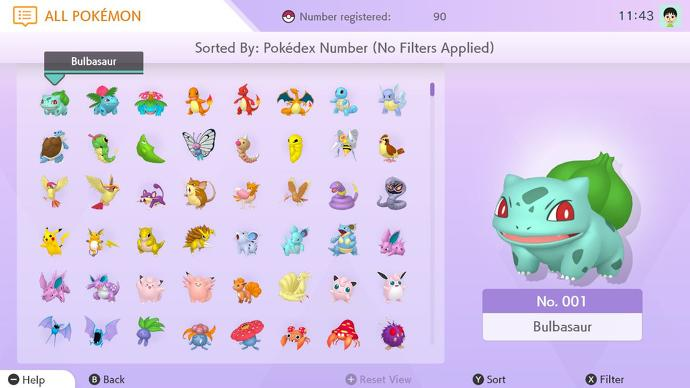

# Classes
When creating an application there are times when we might need to create many objects of the same kind. For example you might need to make many users, item listings, or even Pokemon.



When faced with this kind of repetitiveness it is a perfect time to create a `Class`.

## Table of Contents
- [Classes](#classes)
  - [Table of Contents](#table-of-contents)
  - [Prerequisites](#prerequisites)
  - [Objectives](#objectives)
  - [What is a Class?](#what-is-a-class)
  - [Class Syntax](#class-syntax)
    - [The Constructor](#the-constructor)
    - [this? Wait.. What?](#this-wait-what)
    - [An Instance](#an-instance)
    - [Access an Instances Attributes](#access-an-instances-attributes)
    - [Methods](#methods)
  - [Challenge](#challenge)

## Prerequisites
* Basic JavaScript Syntax
* Objects

## Objectives
By the end of this lesson developers should be able to:

* Define and explain the difference between a class and an instance
* Define a class with proper JavaScript syntax and create multiple instances of said class


## What is a Class?
A `Class` in the context of JavaScript, is a programing-code-template for creating a type of `object` that allows us to define variables and functions.

In the context of a JavaScript `Classes`:
* `Variables` are called  `Attributes`
* `Functions` are called `Methods`

We know basic `functions` allow us to define blocks of code that are reusable. The limitation with functions is that we normally only create them do one specific thing like add two numbers together.

Let's say we want to create an application that allows us to battle pokemon. We could write 3 functions to control our pokemon:
```js
const battle = (attack) => {
    console.log(`The Pokemon attacks with ${attack} and does 5hp of damage`)
}

const eat = (berry) => {
    console.log(`The Pokemon eats an ${berry} berry and gains 10hp!`)
}

const sayHello = (name) => {
    console.log(`${name}!, ${name}!, ${name}! `)
}
```

And if we invoked them we would receive the following:
```js
battle('pounce')
// output: The Pokemon attacks with pounce and does 5hp of damage

eat('Oran')
// output: The Pokemon eats an Oran berry and gains 10hp!

sayHello('Gengar')
// output: Gengar!, Gengar!, Gengar!
```

Our code above works and its pretty clean. But lets say we have a database with over 200 Pokemon and we need to be able to have them all battle at one. Do we really want to write out all that code for each Pokemon? Heck No!

## Class Syntax
So before we jump into converting our loose functions into `Methods` within a `Class`, we need to understand the basic syntax of writing a `Class`. Let's continue with our Pokemon example:

```js
class Pokemon {
    constructor(){
        // Where we define our default Attributes which will be created with each instance
    }

    // Where we define our Methods
}
```

### The Constructor
The `constructor` is a method that is called automatically when a new instance of a class is created. It is what allows us to pass in and define some required `Attributes` that set each instance of the class apart.


Every Pokemon needs a name and a number!
```js
class Pokemon {
    constructor(name, number, hp, type){
        this.name = name,
        this.number = number,
        this.hp = hp,
        this.type = type
    }
}
```

### this? Wait.. What?
`this` is just a way for the `Class` to identify itself. When we write `this.name` we are saying `Pokemon.name`.

### An Instance
An `Instance` is each Pokemon we want to create.

Let's see this in action. Lets say I want to create two new instances of a Pokemon class.
* The `first instance` should be for a Gengar Pokemon
* The `second instance` should be for a Machop Pokemon

```js
class Pokemon {
    constructor(name, number, hp, type){
        this.name = name,
        this.number = number,
        this.hp = hp,
        this.type = type
    }
}

let firstPokemonInstance = new Pokemon("Gengar", 94, 1000, "Ghost")
let secondPokemonInstance = new Pokemon("Machamp", 68, 1500, "Fighting")

console.log(firstPokemonInstance)
console.log(secondPokemonInstance)
```
If you run the code snippet above you will see that each `Variable` is storing a separate `instance` of a Pokemon class.

Each `instance` of the class has stored the `arguments` we passed in to the `constructor` when we initialize it.

### Access an Instances Attributes
In order to access the `attributes` you defined in the `constructor` you must use `dot notation`.

```js
console.log(firstPokemonInstance.name)
// Output: Gengar
console.log(firstPokemonInstance.number)
// Output: 94

console.log(secondPokemonInstance.name)
// Output: Machamp
console.log(secondPokemonInstance.number)
// Output: 68
```

### Methods
`Methods` are just functions that you store inside of a `Class`. They allow you to predefine logical that you want every `instance` of your `class` to be able to do.

Lets move our loose functions into the Pokemon `Class`:

```js
class Pokemon {
    constructor(name, number, hp, type) {
        this.name = name,
            this.number = number,
            this.hp = hp,
            this.type = type
    }

    battle = (attack) => {
        console.log(`${this.name} attacks with ${attack} and does 5hp of damage`)
    }

    eat = (berry) => {
        console.log(`${this.name} eats a ${berry} berry and gains 10hp!`)
    }

    sayHello = () => {
        console.log(`${this.name}!, ${this.name}!, ${this.name}! `)
    }
}

let gengar = new Pokemon("Gengar", 94, 1000, "Ghost")
let machamp = new Pokemon("Machamp", 68, 1500, "Fighting")
```

Now double check to see if our each `instance` contains the newly created `methods`:
```js

console.log(gengar)
console.log(machamp)
```

Now lets check to see if our logic is functional.
```js
machamp.battle("Dynamic Punch")
// Output: Machamp attacks with Dynamic Punch and does 5hp of damage

machamp.eat('Oran')
// Output: Machamp eats a Oran berry and gains 10hp!

machamp.sayHello()
// Output: Machamp!, Machamp!, Machamp!


gengar.battle("Shadow Ball")
// Output: Gengar attacks with Shadow Ball and does 5hp of damage

gengar.eat('Oran')
// Output: Gengar eats a Oran berry and gains 10hp!

gengar.sayHello()
// Output: Gengar!, Gengar!, Gengar!

```


## Challenge
Create an arena class where you can put two pokemon inside of and have them fight.

Your arena class should:
1. Store the pokemon entered into an array
2. Have a fight method where it has each of the pokemon use there attack and then push one out of the arena


